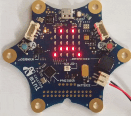
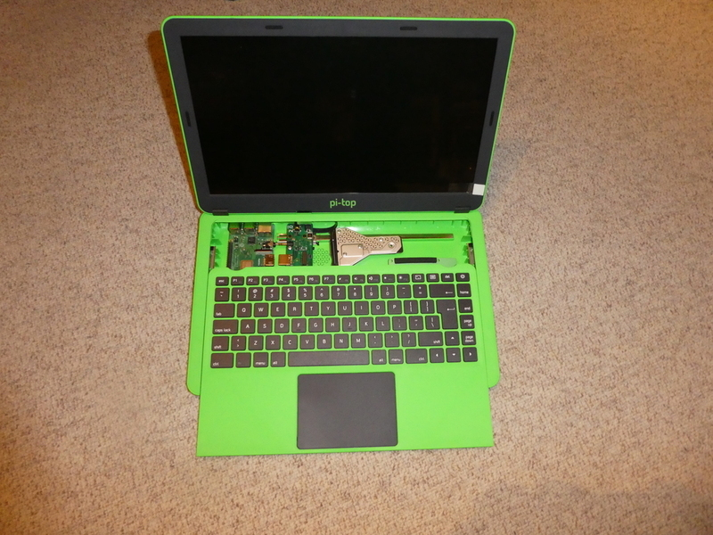
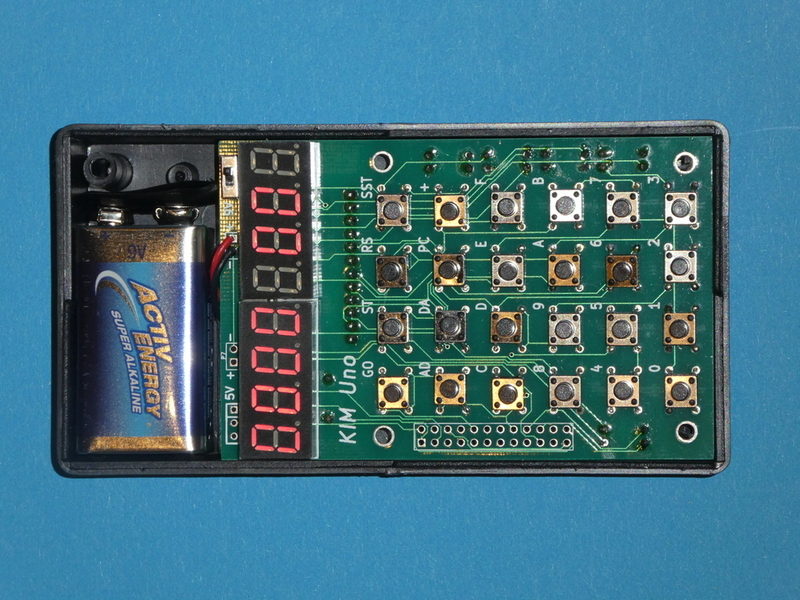
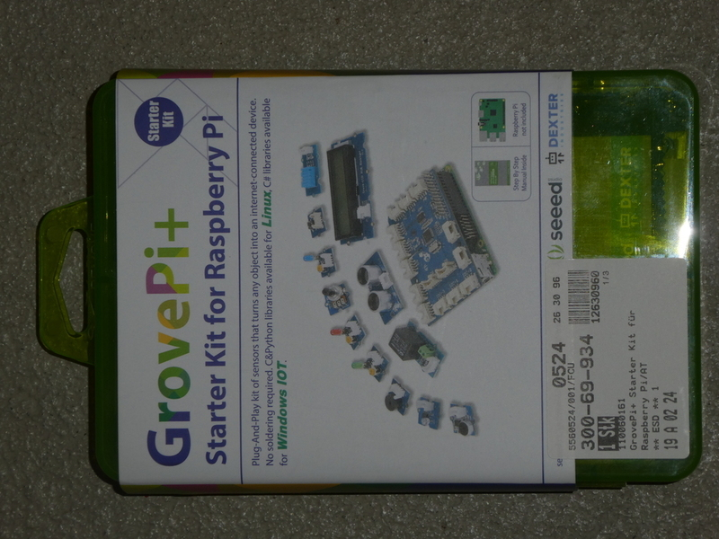
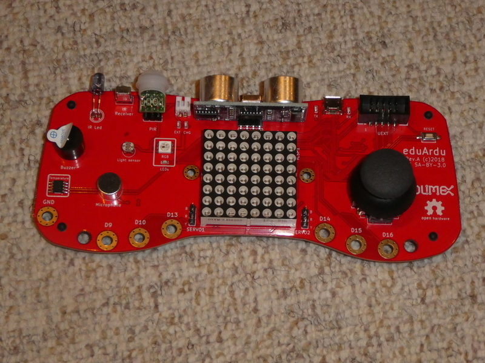
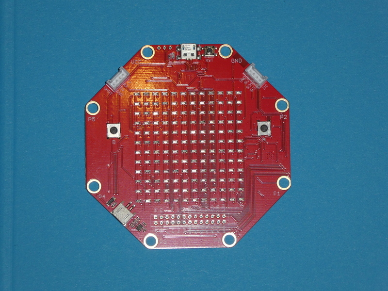
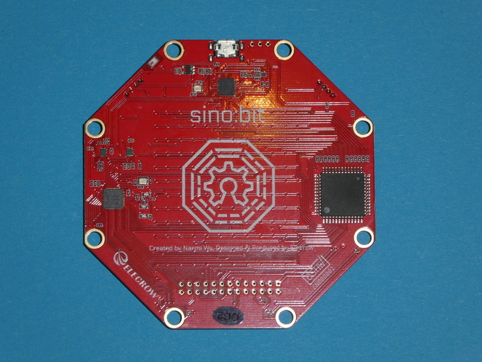
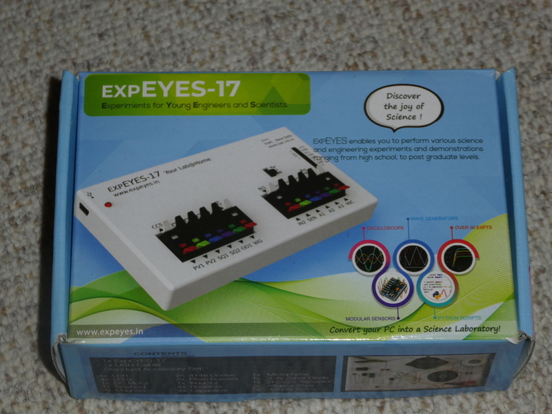

name: title
layout: true
class: middle, center,  inverse 

.footer[ Projekte Meetup Jogi Künstner]
---

.center[

# Arduino,  Raspberry Pi & mehr 
]

---
class: middle, inverse

# Projekte, als Anregung

.left[

- Teensy als USB HID-Device

- Raspberry PI um Radio-Funklöcher zu suchen

- Calliope als Lernplattform für Kinder ab ca 9 

  ]

---

## Teensy als USB HID-Device

---

## Raspberry PI um Radio Funklöcher zu suchen

---

## Calliope Mini als Lernplattform

---

## 

---

## Calliope Kurs Teilnehmer "abholen!"

???

* Grund, dass es so früh am Abend starten soll
* Kinder sollen auch die Chance haben, am Meetup teilzunehmen

---

## Angefangene und nicht angefange
## Projekte weiter machen

---

## Pitop 2

---

## Hardkernel ODROID

---

## KIM Uno, ein Nachbau "meines" ersten Computers 

---

## mBot

---

# Grove-PI

---

## Austesten verschiedener Lern-Plattformen 

---

## Micro:Bit (der Urvater)

.

---

## mit Motor-Platine

---

## Der Calliope (Deutschland)

---

## OXO-Card (die Schweizer Antwort)

---

## und Innereien

---

Kniwwelino ( eine Platform aus Belgien)

---

## EduArdu

---

## sino:bit

---

## die chinesische Antwort auf Micro-Bit und Calliope

---

## "Elektronik-Labor" EXPEYES 

---

## uvm an Elektronik, 
## Microprozessoren, 
## Shields, HATs etc 

---

## Zukünftige Meetups ?

### Wann ? 
### Wie oft ?
### Wie organisiert ?

---

## Was sind Eure Erwartungen?

---

## Konkrete Vorstellungen?

---

## Meine Vorstellung :

.left[
*  Wenig bis 0 Zeit zusätzliche Vorbereitung
*  Meine Projektchen etwas weiterkommen
*  Anlaufstelle für Kinder/Jugendliche 
]
---

## Arduino-Meetup Zürich 
.left[

* Vorstellung ein paar Projekte
* Aufteilung in Interessierte an diesen Projekten
* Gruppen-Arbeit oder auch alleine 

]
---

## Kommentare von Gruppen-Mitgliedern
.left[

* Montag ist schlecht 
* Freitag wäre besser
* 18:00 Uhr ist zu früh

]
---

## Ich könnte mir vorstellen
.left[

* 2 mal im Monat  
* z.B jeder 2.te Montag im Monat 
* Jeder 3.te oder 4.te Freitag im Monat
* Davon einmal komplett "programmlos", treffen, "hacken"
* Das andere Mal mit potentiellem Vorträgen, gemeinsame Projekte
* Programm erst ab ca 19:30 Uhr
* 2ter Organisator wäre toll!

]
---

# Comments, Ideen ?

---

## Lizenz/Copyright-Info

Für alle Texte/Bilder in diesen Slides gilt:

*  Autor: Jörg Künstner
* Lizenz: CC BY-SA 4.0
