name: title
layout: true
class: middle, center,  inverse 

.footer[ Meetup-Turbine Jogi Künstner]
---

.center[

# Arduino,  Raspberry Pi & mehr 

]
===

---
class: middle, inverse

#  Jogi Künstner

.left[

* Elektronik seit ~ 1975 

* Software / Embedded seit ~ 1980  
  [Mein Junior-Computer]( http://www.wolfgangrobel.de/sbc/junior.htm)
* Elektrotechnik/Informations-Technik Studium Technische Uni München 

* Handy - Entwicklung , inzwischen Software-Projekt-Leiter bei Roche

* Vorstand Turbine

* Einige Elektronik Workshops Turbine

* Programmierkurs für Kinder Turbine (jetzt auch Lehrer)

* Mit-Organisation Repair-Cafes 

  ]

---

## Motivation ?

---

## FUN !

---

## Neue Dinge lernen!

---

## Wissen teilen!

---

## Turbinen-Räumlichkeiten nutzen!

---

## Neue Leute kennelernen!

---

## Neue potentielle Helfer kennenlernen :-)

---

## Calliope Kurs Teilnehmer "abholen!"

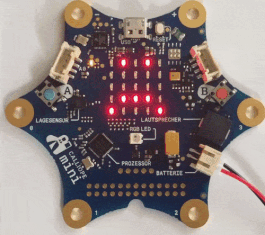

???

* Grund, dass es so früh am Abend starten soll
* Kinder sollen auch die Chance haben, am Meetup teilzunehmen

---

## Angefangene und nicht angefange
## Projekte weiter machen

---

## Pitop 2

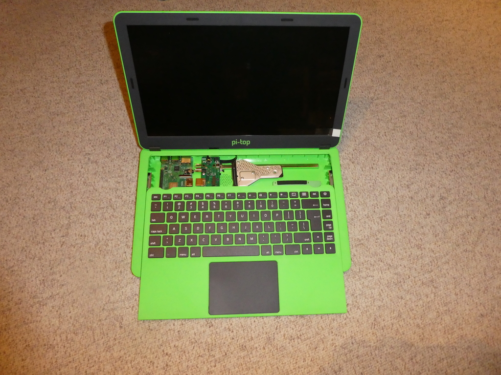

---

## Hardkernel ODROID

---

## KIM Uno, ein Nachbau "meines" ersten Computers 

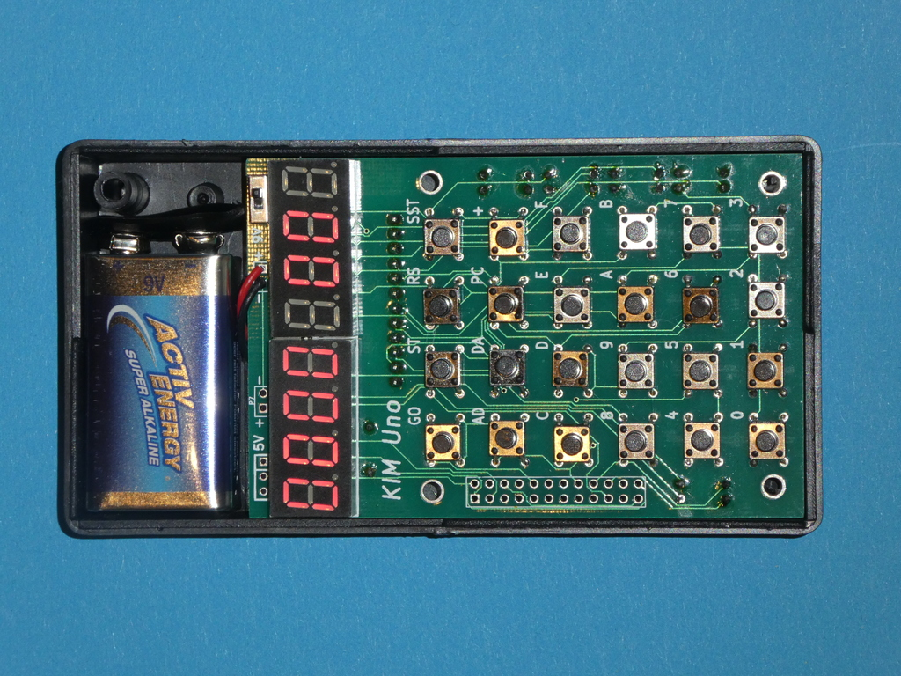

---

## mBot

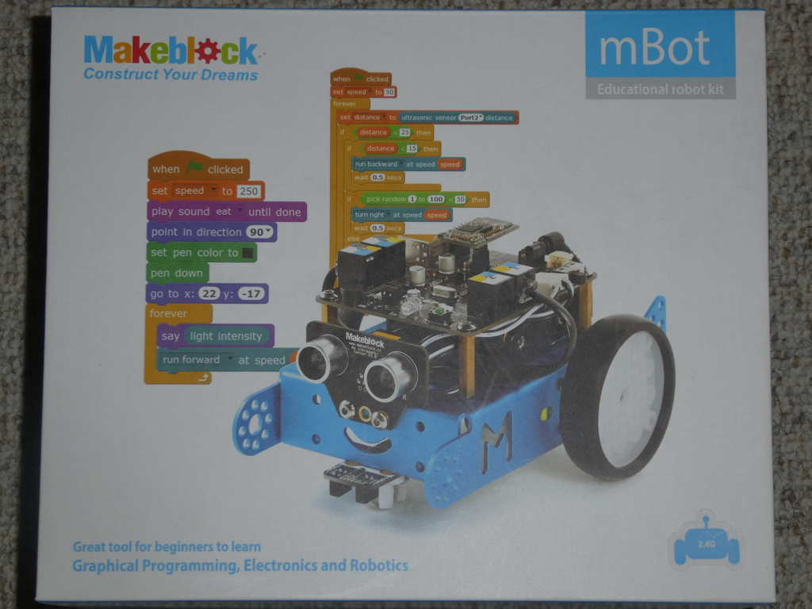

---

# Grove-PI

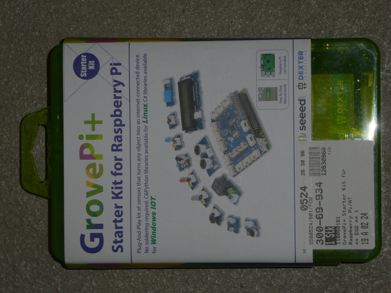

---

## Austesten verschiedener Lern-Plattformen 

---

## Micro:Bit (der Urvater)

.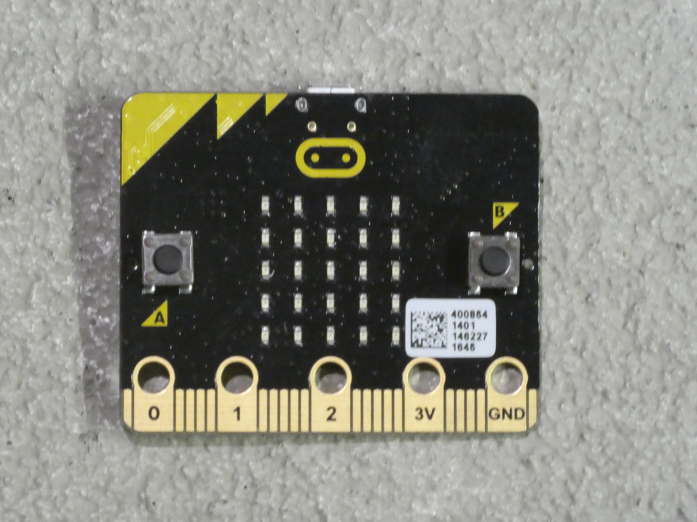

---

## mit Motor-Platine

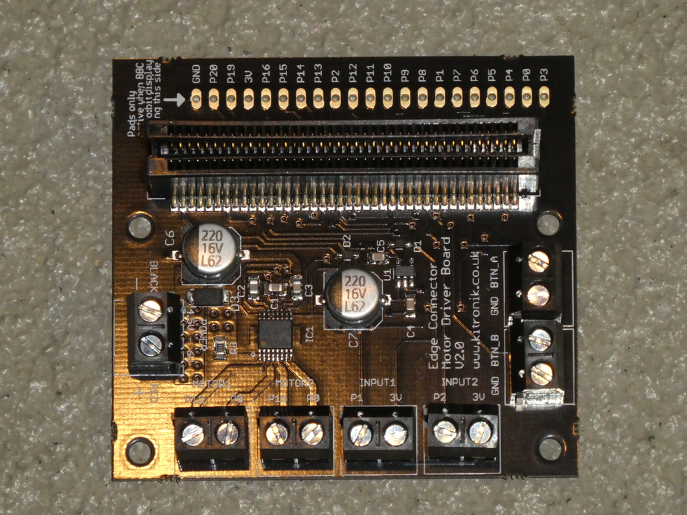

---

## Der Calliope (Deutschland)

---

## OXO-Card (die Schweizer Antwort)

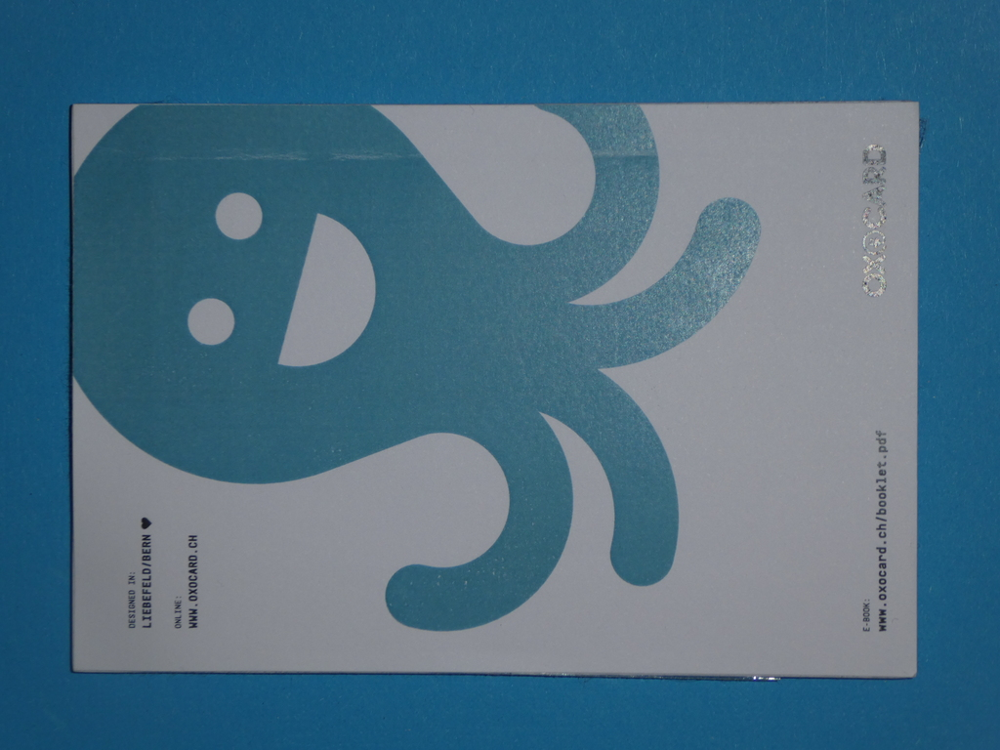

---

## und Innereien

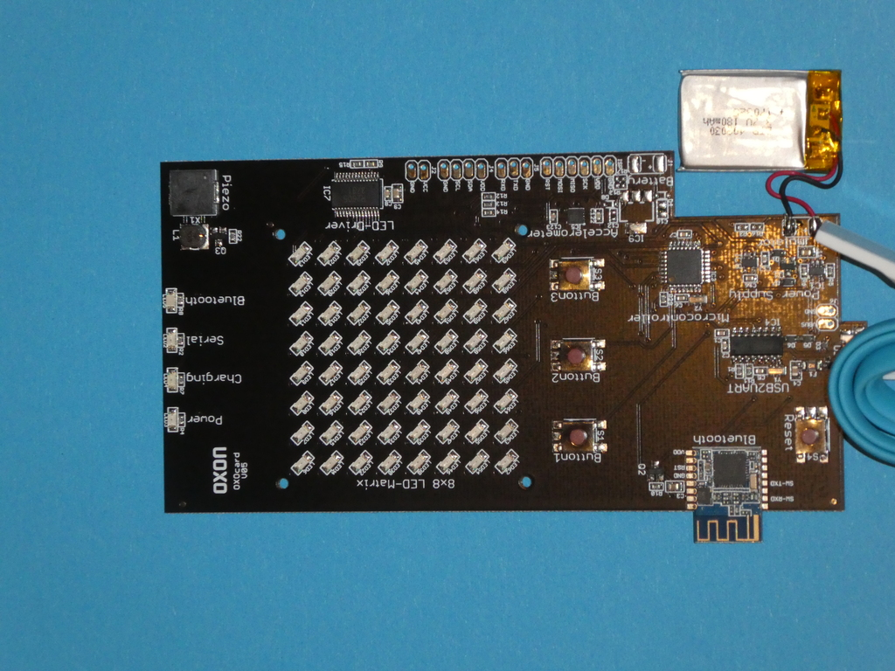

---

Kniwwelino ( eine Platform aus Belgien)

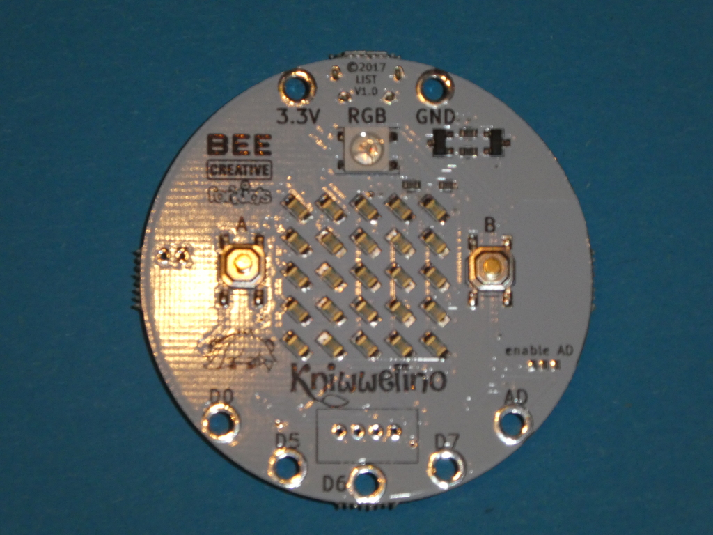

---

## EduArdu

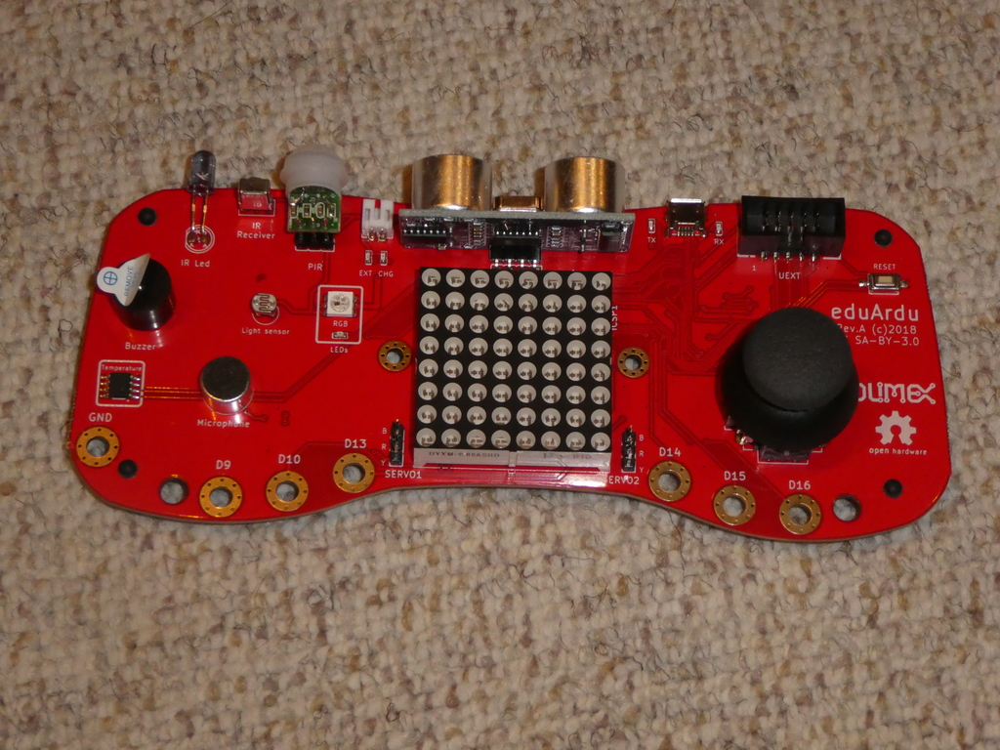

---

## sino:bit

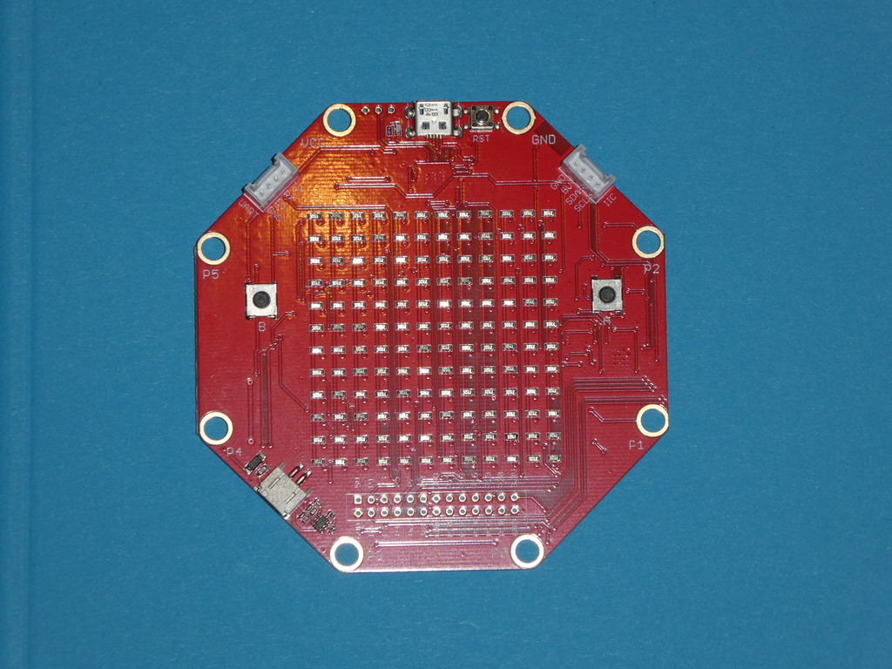

---

## die chinesische Antwort auf Micro-Bit und Calliope

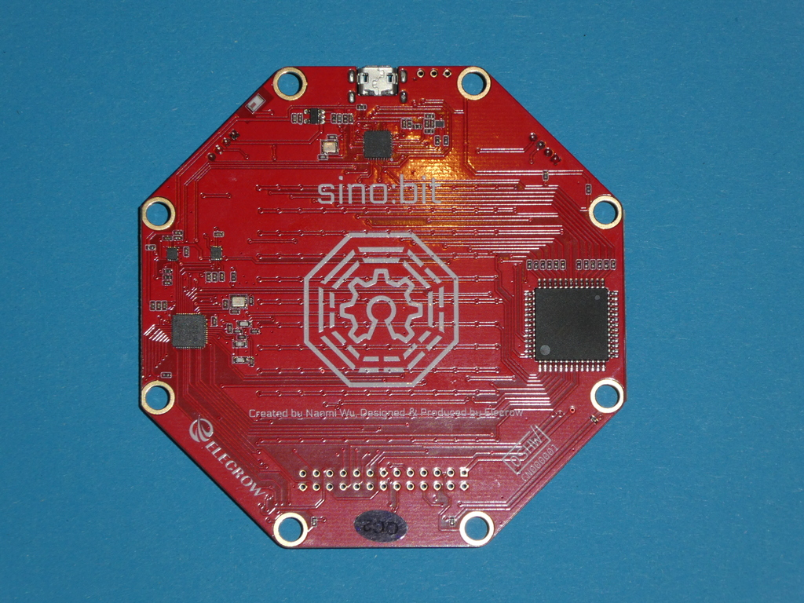

---

## "Elektronik-Labor" EXPEYES 

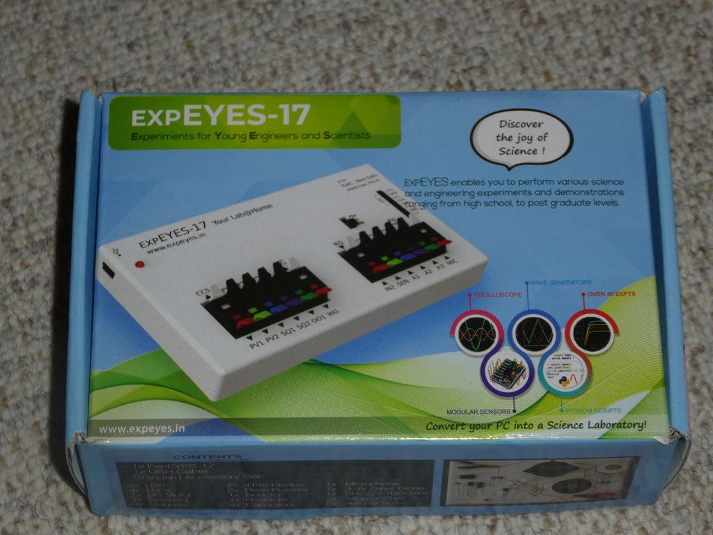

---

## uvm an Elektronik, 
## Microprozessoren, 
## Shields, HATs etc 

---

## Zukünftige Meetups ?

### Wann ? 
### Wie oft ?
### Wie organisiert ?

---

## Was sind Eure Erwartungen?

---

## Konkrete Vorstellungen?

---

## Meine Vorstellung :

.left[
*  Wenig bis 0 Zeit zusätzliche Vorbereitung
*  Meine Projektchen etwas weiterkommen
*  Anlaufstelle für Kinder/Jugendliche 
]
---

## Arduino-Meetup Zürich 
.left[

* Vorstellung ein paar Projekte
* Aufteilung in Interessierte an diesen Projekten
* Gruppen-Arbeit oder auch alleine 

]
---

## Kommentare von Gruppen-Mitgliedern
.left[

* Montag ist schlecht 
* Freitag wäre besser
* 18:00 Uhr ist zu früh

]
---

## Ich könnte mir vorstellen
.left[

* 2 mal im Monat  
* z.B jeder 2.te Montag im Monat 
* Jeder 3.te oder 4.te Freitag im Monat
* Davon einmal komplett "programmlos", treffen, "hacken"
* Das andere Mal mit potentiellem Vorträgen, gemeinsame Projekte
* Programm erst ab ca 19:30 Uhr
* 2ter Organisator wäre toll!

]
---

# Comments, Ideen ?

---

## Lizenz/Copyright-Info

Für alle Texte/Bilder in diesen Slides gilt:

*  Autor: Jörg Künstner
* Lizenz: CC BY-SA 4.0
