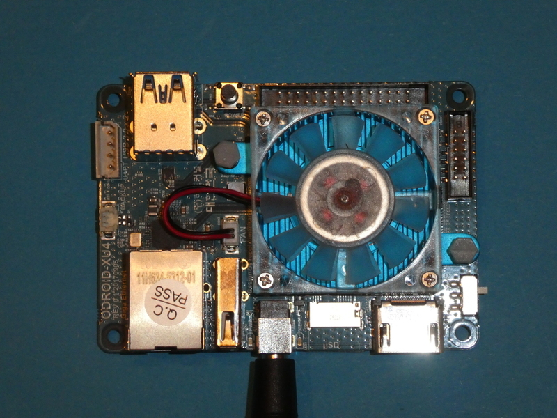
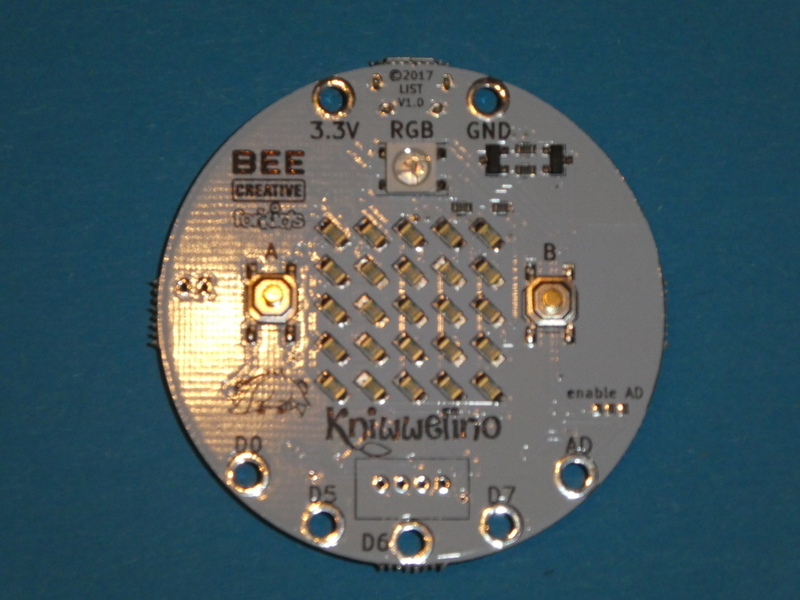

name: title
layout: true
class: middle, center,  inverse

.footer[ Meetup-Turbine Jogi Künstner]
---

Arduino,  Raspberry Pi & mehr 
===

---

.top[

##  Jogi Künstner

]

.left[

* Elektronik seit 1976 

* Software / Embedded seit 1980

* Elektrotechnik/Informations-Technik Studium Technische Uni München 

* Handy - Entwicklung , inzwischen Software-Projekt-Leiter bei Roche

* Vorstand Turbine

* Einige Elektronik Workshops Turbine

* Programmierkurs für Kinder Turbine

* Repair-Cafe 

  ]

---

## Motivation ?

---

## FUN !

---

## Neue Dinge lernen!

---

## Wissen teilen!

---

## Turbine nutzen!

---

## Calliope Kurs Teilnehmer "abholen!"

???

* Grund, dass es so früh am Abend starten soll
* Kinder sollen auch die Chance haben, am Meetup teilzunehmen

---

## Angefangene und nicht angefange
## Projekte weiter machen

---

## Pitop 2

---

## Hardkernel ODROID

---

## KIM Uno, ein Nachbau "meines" ersten Computers 

---

## mBot

---

# Grove-PI

---

## Austesten verschiedener Lern-Plattformen 

---

## Micro:Bit (der Urvater)

.

---

## mit Motor-Platine

---

## Der Calliope (Deutschland)

---

## OXO-Card (die Schweizer Antwort)

---

## und Innereien

---

Kniwwelino ( eine Platform aus Belgien)

---

## EduArdu

---

## sino:bit

---

## die chinesische Antwort auf Micro-Bit und Calliope

---

## "Elektronik-Labor" EXPEYES 

---

## Lizenz/Copyright-Info

Für alle Bilder in diesen Slides gilt:

*  Autor: Jörg Künstner
* Lizenz: CC BY-SA 4.0
